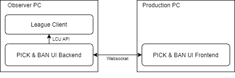

# lol-champselect-ui
UI to display the league of legends champion selection in esports tournaments.

## Architecture:

## Who used this?
It is most convincing to see the tool directly in action. Have you used it in any of your productions or projects? Feel free to send a pull request adding your project to this list along our way.

- Red Bull Itemania 2019 (aired on https://twitch.tv/redbull)
- Logitech G LoL Cup 2020 (aired on https://twitch.tv/myinsanitytv)
- Swisscom Hero League Season 3 (aired on https://twitch.tv/eslswiss)
- Intel Arabian Cup (IAC) (airing on https://www.twitch.tv/lolarabia)

## Features
- Connects to the League Client and fetches information about the current champ select in real time
- Automatically fetches champion loading images, splash arts and square icons from datadragon, which means that if a new champion
is released it will automatically fetch the correct resources.
- Ready to use design templates:
  - Europe (similar to the pick&ban UI used in the LEC)
- Easy feature toggle (when using design templates) for:
  - Show / hide scores (usable if it's not best of 1)
  - Show / hide coaches
  - Show / hide summoner spells (usable in live matches on the live server where the enemy team is not supposed to see the summoner 
  spells of the opposite team.
- Easy configuration:
  - Set team names
  - Set coach names
  - Set score
  - Set colors (default blue/red, but they can differ!)
- Allows to completely create a custom design based on web technologies (HTML, CSS & JS), including custom animations and
transitions

### Replays (Playing a recorded champ select)
Replays are available. They are pretty useful to test your overlay with, since it mocks the data sources and simulates a draft phase, that has already passed. There are some recordings of replays in the "recordings" folder.

In order to play a replay that simulates a full tournament draft, please issue the following command to start the backend (the root project):

`npm start -- --data recordings/tournament-draft`

While you are in a replay, you can focus the window and press "p" on your keyboard once, to pause or unpause the replay. This will freeze the current state, so you can adapt your design without having to hurry.

## Configuration
You can configure the variable values, like team names, team scores, coach names and even the colors used. Just open up the file config.json in the project root with any texteditor, like notepad. Any changes you do inside this file will be reflected immediately and do not require a restart or reload.

## Installation (Development purposes)
Please note: if you're looking for an easier installation, have a look at this project: https://github.com/FearNixx/vigilant-bans (the linked project is not associated or affiliated with the Riot Community Volunteers, and we can provide no warranty for the linked project)

1. Download and install Node.JS for Windows (or any other operating system): https://nodejs.org/dist/v10.16.3/node-v10.16.3-x64.msi
2. Download or clone this Git-Repository to your local machine.
3. Inside the downloaded folder, open up a command prompt (Windows: Shift + Rightclick -> Open Powershell / Commandline Window here)
4. Install all required dependencies for the backend using the command `npm install`
5. Start the backend using the command `npm start`
6. The backend should now launch on localhost:8999

### Installation of europe layout
7. Open up the folder `layouts/layout-volu-europe`, keep the backend open & running!
8. Also open the terminal here (like in step 3)
9. Also issue `npm install` (like in step 4)
10. Also start the frontend using `npm start` (like in step 5)
11. The application will now be accessible under http://localhost:3000?backend=ws://localhost:8999

### Installation of simple layout
Please note that the simple layout cannot be directly used out of the box, it is more like an example of how you can create your own overlay. It is created as simple as possible from code perspective, thus it's name, but it is not simple to install and use.
You also need to edit the two files "overlay.png" and "underlay.png" in the folder layouts/layout-simple. We have provided some example, however you need to do it on your own.

7. Open up another terminal in the project root folder, using `Shift + Rightclick -> Open Powershell`.
8. You only need to execute the following command once: `npm install -g serve`
9. Now start the local web server, using the simple command `serve`
10. Now the application is accessible under http://localhost:5000/layouts/layout-simple/?backend=ws://localhost:8999

## Demo (YouTube)

## Creating your own design
Please refer to [CUSTOM_THEME](CUSTOM_THEME.md).

## Contributors / Maintainers
- Development: Lars "Larce" Bärtschi
- Design (Europe): Elias "Elilift" Inäbnit

## Legal disclaimer
lol-pick-ban-ui was created under Riot Games' "Legal Jibber Jabber" policy using assets owned by Riot Games. Riot Games does not endorse or sponsor this project.
However, Riot was informed and has confirmed that this project is compliant with their ToS.
